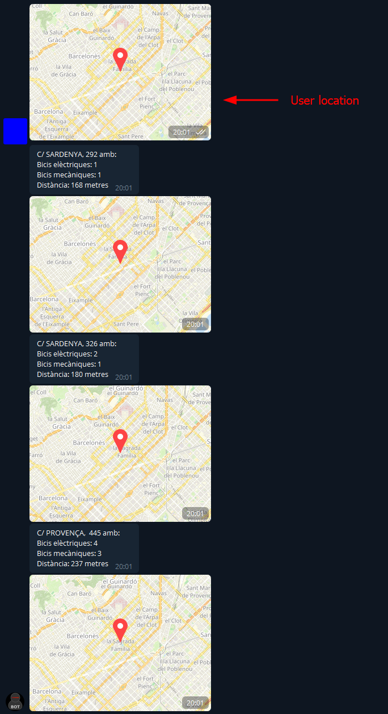

# Telegram bot

I have developed a Telegram Bot that lets me poll for the 3 most nearby stations with bikes on them by just sending him my location. 
I also have functionality for nearby stations from home. This is an small sample of the code, for the full bot you can check this [Github page](https://github.com/SmartDnkey/BotTelegram)

First the script fetches the information of all the stations (station information) and the real-time status (station status). 
Then, for each station the script calculates the distance between the location of the user and the station and extracts the number of mechanical and electric bikes available. 
It stores that information in an object named Stations. If the station is working (IN_SERVICE) and there is at least 1 available bike it adds the stations in an stations list.

Then it sorts the list stations by the distance to the user. Finally, the script returns the 3 nearest stations information

```
def fetchBicing(location):
    si = json.loads(requests.get('https://api.bsmsa.eu/ext/api/bsm/gbfs/v2/en/station_information').content)
    ss = json.loads(requests.get('https://api.bsmsa.eu/ext/api/bsm/gbfs/v2/en/station_status').content)['data'][
        'stations']
    id = 0
    stations = []
    for station in si['data']['stations']:
        stLocation = (station['lat'], station['lon'])
        dist = geodesic(location, stLocation).meters
        s = Station(station['name'], station['lat'], station['lon'], dist)
        s.status = ss[id]['status']
        s.mech = int(ss[id]['num_bikes_available_types']['mechanical'])
        s.elec = int(ss[id]['num_bikes_available_types']['ebike'])
        if s.status == 'IN_SERVICE' and s.mech + s.elec > 0:
            stations.append(s)
        id += 1
    stations.sort(key=lambda x: x.distance)
    message = []
    for i in range(0, 3):
        message.append({'text': f'{stations[i].name} amb:\nBicis elèctriques: {stations[i].elec}\nBicis mecàniques: ' \
                   f'{stations[i].mech}\nDistància: {int(stations[i].distance)} metres\n',
                        'long': stations[i].long, 'lat': stations[i].lat})
    return message

```

<figure markdown>
  
  <figcaption></figcaption>
</figure>