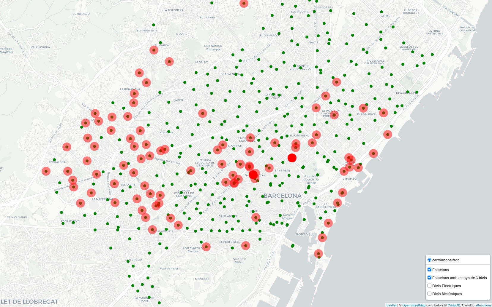
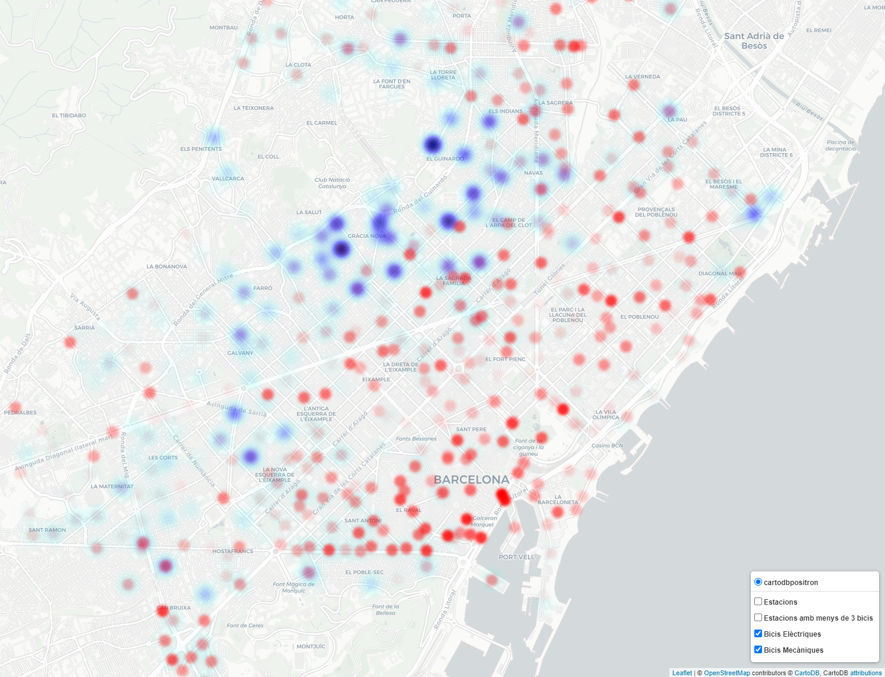

# Bicing Heatmap

As a frequent Bicing user this summer I have not been able to use the service as much as I would like to. My neraby 
stations were almost everyday empty. I decided to evaluate the state of the bicing service by doing a Heatmap with different services.

Here you can find a peek, but I have to find a way to update it every 15-30 minutes.

[Heat Map](Map.html)

<figure markdown>
  
  <figcaption></figcaption>
</figure>

<figure markdown>
  
  <figcaption></figcaption>
</figure>

