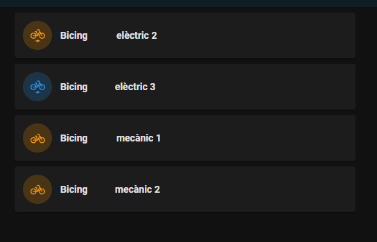

# HomeAssistant sensor for Bicing

As well as with a Telegram Bot, I would like to know the status of my nearby stations with any dashboard of my HomeAssistant.
Maybe in the future implement some kind of automatization (For example automatically reserve a bike with a button)

## Sensors
Here is the snipped of the sensors.yaml that extracts the information I need

```
- platform: rest
  resource: https://api.bsmsa.eu/ext/api/bsm/gbfs/v2/en/station_status
  name: Bicing
  value_template: "{{value_json.data.stations[#].status}}"
  scan_interval: 300
  json_attributes_path: "$.data.stations[#].num_bikes_available_types"
  json_attributes:
    - ebike
    - mechanical
```

It polls the api every 5 minutes (maybe I should reduce the timing). Remember to change the # by the appropriate station. 
Also in the future I should add another identifier for the station.

## Dashboards
By adding this information in a dashboard with the mushroom-template-cards it looks quite good. Template code:

```
type: custom:mushroom-template-card
primary: '    Bicing elèctric {{states.sensor.bicing.attributes.ebike}}'
secondary: ''
icon: mdi:bicycle-electric
layout: horizontal
entity: sensor.bicing
icon_color: |-
  
  red
  
  orange
  
  blue
  
badge_icon: ''
multiline_secondary: true
fill_container: true
tap_action:
  action: none
```

As you can see the color changes depending on the number of bikes available

<figure markdown>
  
  <figcaption></figcaption>
</figure>

