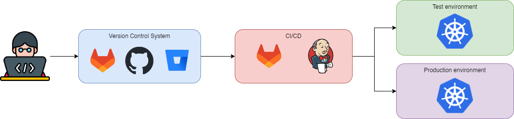

# Introduction to Software deployment for microservices
last update October 2023

From the developer computer to the production environment the deployment of new software can be a long process with 
multiple steps. If we want to secure our applications we need to understand what's happening and what controls we can 
implement. We are going to take an overview with microservices. We could do a similar exercise with other architectures 
That would require other tools. 

<figure markdown>
  
  <figcaption></figcaption>
</figure>

We start with the work of the Software Engineers that implement the new code for the application. This code is pushed
to a **Version Control System** and, hopefully, after a **Peer Review** it is approved to be integrated. 

An automatic pipeline is launched that will perform all the step needed to deploy the code. For example, in the case of 
a Java application it needs to download all the dependencies, compile the application, create a docker images and test 
that it works correctly before the deployment to test. Then, after the appropriate requirements are met it can finally 
be moved to production.

As a security engineer we know that this process is not going to work smoothly and that the developers are going to 
introduce risks unintentionally. What happens when a security vulnerability is discovered in a used library? 
Are we sanitizing the inputs correctly? Do we have passwords or tokens stored insecurely in the code? Are we deploying 
the images that we created or can we deploy and external one?

We can evaluate all this questions with different types of security tools. 
